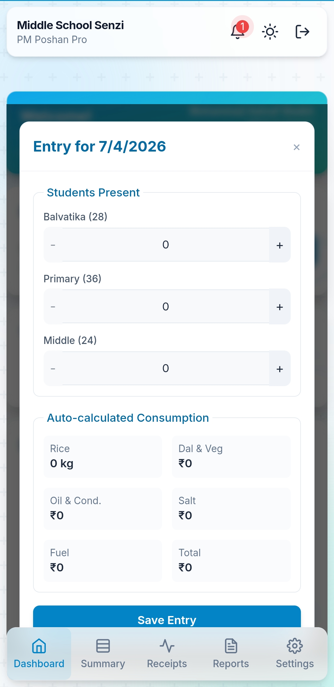
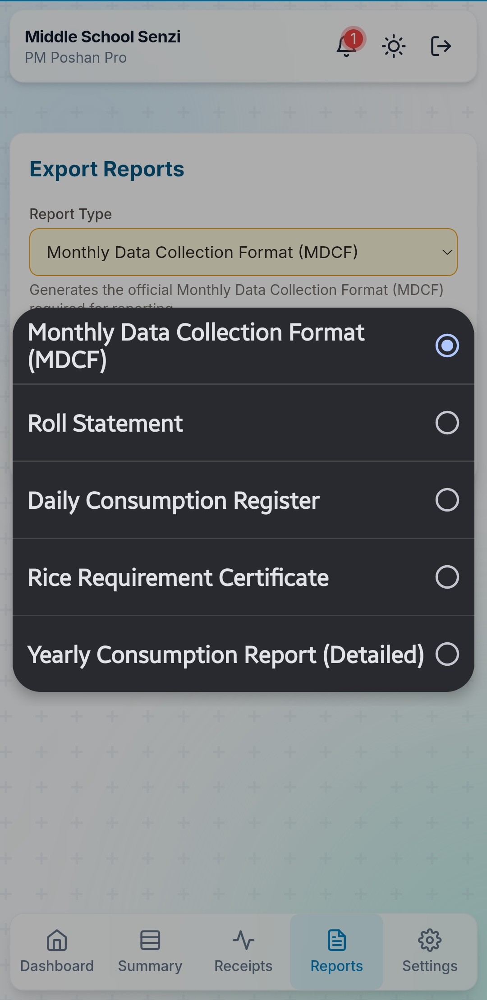

PM Poshan Pro

Offline ready PM POSHAN Mid Day Meal management system for schools. Designed for fast daily entry and official report export.

Screenshots

Daily Entry

Reports Export

Features

• Daily attendance entry
• Auto calculated rice consumption
• Dal, veg, oil cost calculation
• Monthly Data Collection Format export
• Roll statement export
• Daily consumption register
• Rice requirement certificate
• Yearly consumption report
• Offline support
• Mobile friendly design

Use Case

Designed for schools to manage PM POSHAN records digitally and generate official reports instantly.

Tech

HTML
CSS
JavaScript
LocalStorage

Author

Emraan Mugloo

This will make your repo look professional immediately.
